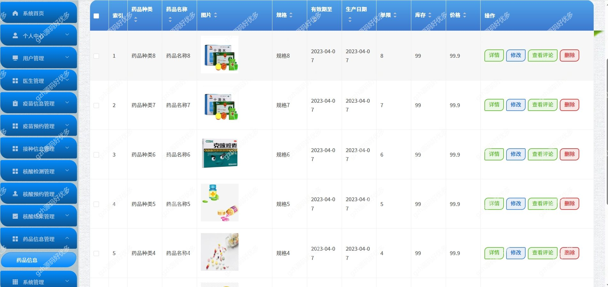
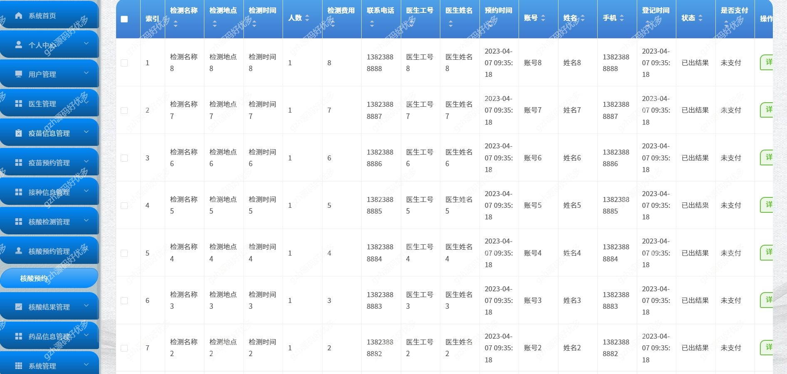
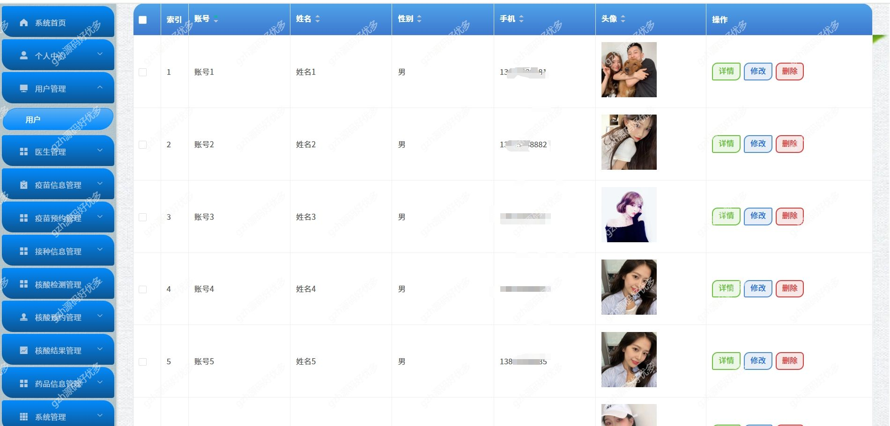
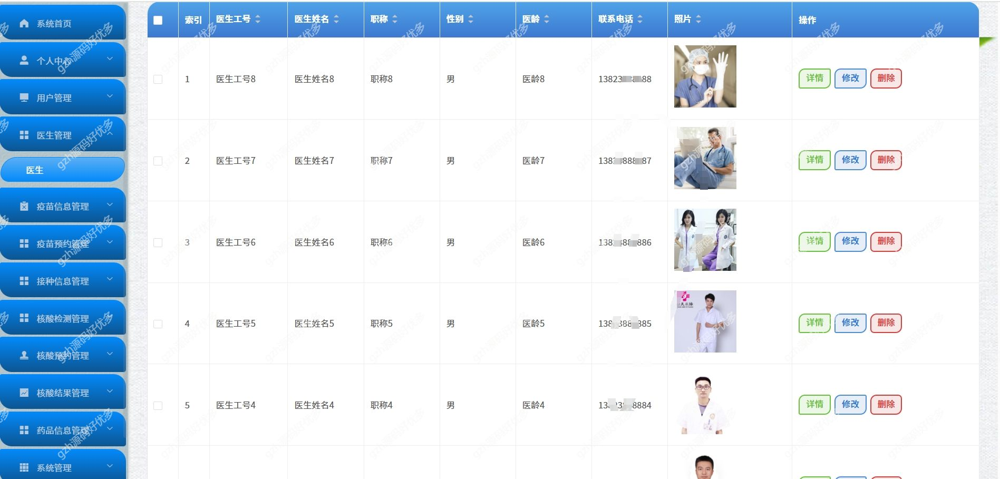
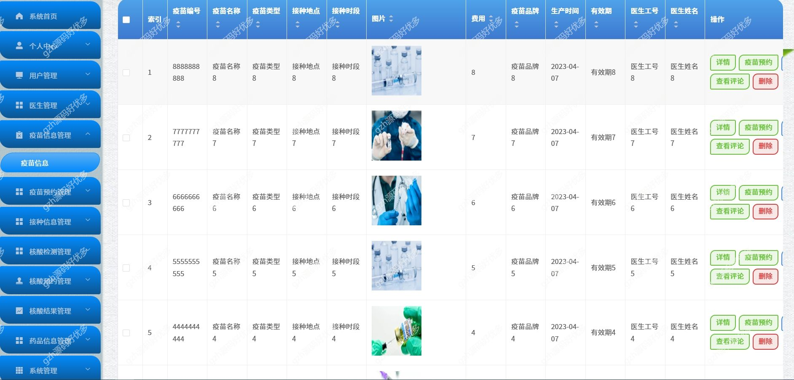
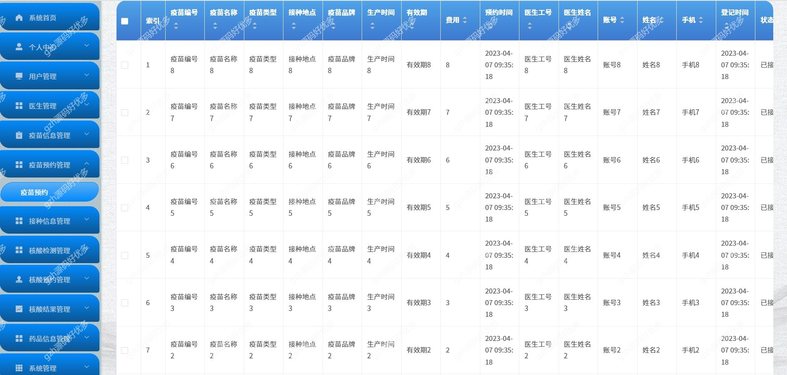
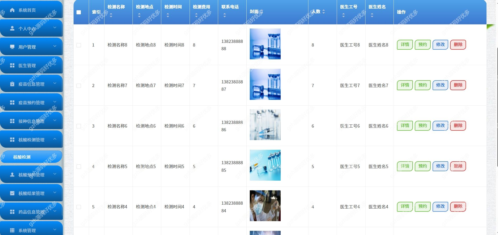

# springbootA318
springbootA318医院疫情防控管理系统
 
## 查看主页获取源码

### 一、关键词
医院疫情防控管理系统，医院疫情系统

### 二、作品包含
源码+数据库+万字设计文档+PPT+全套环境和工具资源+本地部署教程

### 三、项目技术
前端技术：Html、Css、Js、Vue2.0、Element-ui 
后端技术：Java、SpringBoot2.0、MyBatis

### 四、运行环境（以下版本亲测，其他版本兼容性请自行测试）
开发工具：IDEA/eclipse  + VSCODE
数据库：MySQL5.7

数据库管理工具：Navicat10以上版本

环境配置软件： JDK1.8 + Maven3.6.3

前端Nodejs：14

浏览器：谷歌浏览器

### 五、项目介绍
项目编号：springbootA318

随着科技发展进步，我们已进入了信息化社会，仅仅依靠传统的表格管理方式已不能适应时代的要求。因此使用计算机来进行接手传统方式已经势在必行

该系统主要设计并完成了管理过程中的用户注册登录、个人信息修改、疫苗信息、疫苗预约、接种信息、核酸检测、核酸预约、核酸结果、药品信息等功能

### 六、运行截图

